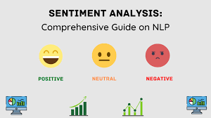
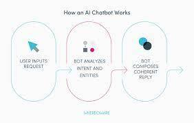
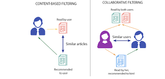
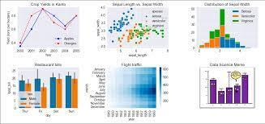
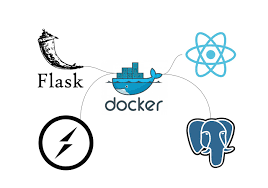

# Ankit Soni's Data Science Portfolio

Welcome to my data science portfolio! Here, you'll find details about the projects I've worked on, showcasing my skills in machine learning, data analysis, and more.

## Projects

### 1. Sentimental Analysis using NLP

Conducted sentimental analysis of the stock market using Python. Utilized NLP techniques to analyze and classify news articles and social media sentiment related to stocks. Generated insights to inform investment decisions.

GitHub Repository: [Sentiment Analysis Project](https://github.com/Ank-its/Sentimental-analysis-of-stock-market)

### 2. Holiday Classification

Developed a holiday classification system using Python. Employed machine learning algorithms to classify dates as holidays or non-holidays. Improved accuracy by incorporating various data sources and features.

GitHub Repository: [Holiday Classification Project](https://github.com/Ank-its/Holiday-Classification-)

### 3. Time Series Forescating of stock market

Conducted comprehensive stock market analysis using Python. Collected and processed historical stock price data. Implemented various financial indicators and conducted trend analysis.

GitHub Repository: [Stock Market Analysis Project](https://github.com/Ank-its/Stock-Market-Analysis-using-Python)

### 4. Movie Recommendation System

Developed a personalized movie recommendation system using Python, R, and machine learning techniques. Implemented collaborative filtering and content-based filtering algorithms to enhance recommendation accuracy.

GitHub Repository: [Movie Recommendation System Project](https://github.com/Ank-its/Movie-Recommendation-System)

### 5. Data Visualization in Seaborn

Created interactive and informative visualizations using Seaborn library. Explored various datasets to showcase the power of data visualization in extracting insights.

GitHub Repository: [Data Visualization in Seaborn](https://github.com/Ank-its/Data-Visualization-in-Seaborn)

### 6. CRUD API

Developed a full-stack CRUD API application using Docker, Flask, React, Python, and PostgreSQL. Implemented Create, Read, Update, Delete operations with a scalable and containerized architecture.

GitHub Repository: [CRUD API](https://github.com/Ank-its/Crud_API)

## Skills & Abilities

- Python, SQL, R
- Exploratory Data Analysis (EDA)
- Data Mining
- Data Visualization (Power BI, Tableau)
- Statistical Inference
- Data Modeling
- Unstructured Data
- Analytical and Business Insights
- Docker, PostgreSQL

## Contact

- Email: ankitsoni6937@gmail.com
- LinkedIn: [linkedin.com/in/ankit-soni-bb7404230](https://www.linkedin.com/in/ankit-soni-bb7404230)
- GitHub: [github.com/Ank-its](https://github.com/Ank-its)
